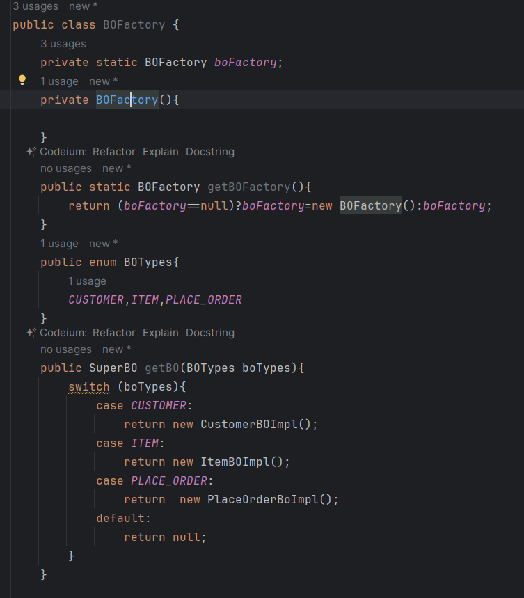

<h1>Design Pattern</h1>
<h3>Type of Design Pattern 3</h3> 
<h4>01.Creational</h4>
<ul>
    <li>Singleton Design Pattern</li>
        <h4>* Constructor Private *</h4>
        <h4>* instance Private and static*</h4>
        <h4>* getInstance public and static *</h4>
        
    <li>Factory Design Pattern</li>
        <h4>* object creation hide *</h4>
        
        <h4>use it :   
            BOFactory.getBOFactory().getBO("ITEM");
        </h4>
        <h4>ex:BO layer DAO layer</h4>

    <li>Prototype Design Pattern</li>
    <li>Builder Design Pattern</li>
</ul>
<h4>02.Structural</h4>
<h4>03.Behavioral</h4>